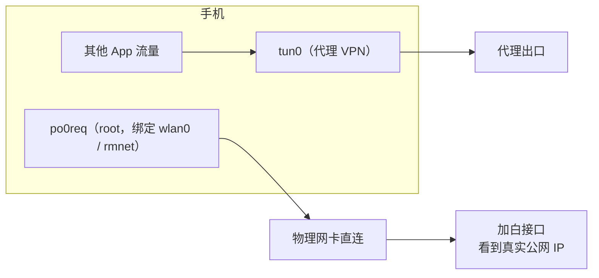

# po0fw-magisk

po0fw 防火墙白名单自动加白的 Android root 模块（Magisk / KernelSU / APatch）。

**切网即时 + 定时兜底**自动 POST 加白接口；请求用 root **绑定物理网卡直连**，开着代理 VPN 也能把本机真实公网 IP 加进白名单。

## 为什么不用 MacroDroid

po0fw 文档里给安卓推荐的是 MacroDroid：建两个宏，切网时和每 15 分钟各 POST 一次。能用，但有几个坑：

| | MacroDroid / HTTP Shortcuts | po0fw-magisk |
|---|---|---|
| 开着代理 VPN 时 | 请求走不走代理看分流规则，走了就会加白成代理出口 IP | 绑定物理网卡直连，加白的一定是真实公网 IP |
| 后台存活 | 要关电池优化，仍可能被系统杀掉 | 开机由 root 管理器拉起的守护进程，不依赖 App |
| 切网检测 | 系统广播 | 内核网络事件（`ip monitor`），约 3 秒内加白 |
| 静默换 IP | 每 15 分钟 | 定时兜底，默认 10 分钟，可调 |
| 需要 root | 不需要 | 需要 |



## 功能

- **切网即时加白**：Wi-Fi ⇄ 蜂窝、换 Wi-Fi、DHCP 换 IP、断线重连，网络安静约 3 秒后加白
- **定时兜底**：默认每 10 分钟一次，捕捉 Wi-Fi 没断但公网 IP 变了、蜂窝静默换 IP
- **失败退避重试**：5 → 15 → 30 → 60 → 120 → 300 秒；token 错误（HTTP 4xx）按兜底间隔再试，不狂刷
- **状态一目了然**：模块列表描述实时显示 `[✅ 09:12 已加白 · Wi-Fi]`；管理器「操作」按钮立即加白并显示结果
- **即改即生效**：改配置、在管理器里停用 / 启用模块都几秒内生效，不用重启
- WebUI：看状态、填 token、改兜底间隔、立即加白、看日志、查证书
- 支持纯 IPv6 蜂窝（464XLAT）、自签证书（公钥固定）、同时加白多个接口
- token 不写进日志，发请求时也不会出现在进程命令行里
- 省电：平时阻塞等待，不轮询；深度睡眠时不唤醒 CPU，醒来后补做逾期的兜底
- 管理器内检查更新（`updateJson`）

## 安装

1. 从 [Releases](https://github.com/l1uz3/po0fw-magisk/releases) 下载 `po0fw-vX.Y.Z.zip`
2. 在 Magisk / KernelSU / APatch 管理器里刷入，重启
3. 填 token（见下一节）

要求：arm64-v8a 或 armeabi-v7a 设备；Magisk ≥ 20.4（「操作」按钮需要 Magisk ≥ 28）、KernelSU 或 APatch。

模块不挂载任何系统文件，KernelSU / APatch **不需要装元模块**（metamodule）。

## 填 token

任选一种，改完不用重启，几秒内生效：

- **WebUI**（推荐）：在 KernelSU / APatch 管理器里打开本模块的 WebUI，填 token 后点「保存并加白」（Magisk 可用 MMRL 等支持模块 WebUI 的应用）
- **文件**：用 MT 管理器编辑 `/data/adb/po0fw/config.conf`，把 `URL=` 里的「你的token」换掉
- **刷入前**：用 MT 直接编辑 zip 里的 `config.conf`，安装时会自动带上

然后在管理器里点「操作」，看到 `HTTP 200` 就成功了。

## 命令行（排查用，可选）

平时用 WebUI 和「操作」按钮就够了。模块不往系统里装命令，需要时用完整路径执行主脚本：

```
su -c sh /data/adb/modules/po0fw/po0fw.sh <命令>

status              运行状态、当前网络、上次结果
now                 立即加白一次
token <token>       设置 token 并立即加白
url <URL>           设置完整 URL 并立即加白
set INTERVAL 300    修改其他配置项
log [行数|-f]       查看日志
cert                查看服务端证书和公钥 PIN
net                 查看识别到的默认网络
start|stop|restart
```

## 配置项

配置文件：`/data/adb/po0fw/config.conf`（更新模块不会覆盖）

| 项 | 默认 | 说明 |
|---|---|---|
| `URL` | — | 加白接口，可以写多行同时加白多个 |
| `INTERVAL` | `600` | 定时兜底间隔（秒） |
| `SETTLE` | `3` | 网络变化后等多少秒网络安静了再加白 |
| `BIND_IFACE` | `1` | `1` 绑定物理网卡直连；`0` 走系统默认路由（开着 VPN 时会走代理） |
| `IFACE` | 空 | 手动指定网卡；留空自动识别系统默认网络 |
| `INSECURE` / `PIN` | `0` / 空 | 服务端是自签证书时：`INSECURE=1` 并填 `PIN=sha256//…`（WebUI「证书信息」可查） |
| `TIMEOUT` | `10` | 单次请求超时（秒） |
| `IPV` | `4` | `4` 只走 IPv4；`6` 只走 IPv6；留空自动 |
| `DNS` | `223.5.5.5 119.29.29.29` | 仅 URL 写域名时使用，同样经物理网卡直连解析，避开代理的 fake-ip |
| `OK_REGEX` | 空 | 响应体必须匹配这个正则才算成功；留空只看 HTTP 2xx |
| `DEBUG` | `0` | `1` 在日志里记录每个网络事件 |

## 工作原理

- **找默认网络**：读 netd 的 `fwmark 0x0/0xffff` 路由规则，拿到系统默认网络对应的物理网卡。VPN 不会改这条规则，所以开着 VPN 也能拿到底下的 Wi-Fi / 蜂窝网卡。
- **绕过 VPN**：请求由 `po0req`（纯 Go 标准库写的静态小程序）发出，socket 用 `SO_BINDTODEVICE` 绑到这张网卡。netd 给 root 留了一条 `oif <网卡> uidrange 0-0` 的规则，优先级排在 VPN 的 uid 规则前面，所以请求直接从物理网卡出去。
- **触发**：`ip monitor` 监听地址、路由、规则变化，去抖后比对「网卡 + IPv4 + 网关」指纹，变了或网卡重新拿到地址就加白；`inotifyd` 监听配置文件和管理器的停用开关；兜底计时用 `/proc/uptime`（含深度睡眠时间）。
- **安全**：token 通过环境变量传给 `po0req`，不出现在 `/proc/<pid>/cmdline`；日志里的 token 打码；配置目录 0700、文件 0600；证书默认按 Android 系统 CA 校验（优先用 Conscrypt APEX 里的新版证书）。

## 排查

- 日志在 `/data/adb/po0fw/po0fw.log`，或在 WebUI 里点「查看日志」
- **证书校验失败**：先在 WebUI 里点「证书信息」。确认是服务端自签证书的话，设 `INSECURE=1` 并填上显示的 `PIN`
- **HTTP 403**：token 不对，或接口拒绝了请求
- **一直显示「等待网络」**：当前没有可用的 IPv4 网络，可以用上面命令行里的 `net` 看识别结果
- **用 box / akashaProxy 这类 iptables 透明代理**（而不是 VPN 模式）：这类代理可能连 root 自己的流量也拦截，请在代理规则里让加白接口的 IP 走直连，或者把 uid 0 排除
- 系统的 `ip` 不支持 `monitor` 时，会自动退回每 5 秒检查一次网络，日志里会有提示

## 开发

```
module/            模块本体（打包进 zip）
  po0fw.sh         主脚本：守护进程 + 命令行
  src/po0req/      po0req 源码（纯 Go 标准库）
  webroot/         KernelSU / APatch WebUI
test/              网络命名空间模拟测试
pack.sh            打包脚本
update.json        管理器检查更新用
```

**构建**：`sh pack.sh`，产物在 `dist/po0fw-<版本>.zip`。需要 Go ≥ 1.21 和 zip；会顺带编译 `po0req`，zip 里只带 arm64-v8a、armeabi-v7a 两个架构。

**测试**：`sudo bash test/run_all.sh`。测试会在 Linux 网络命名空间里仿出 Android netd 的策略路由，包括一条把 root 流量也导进 `tun0` 的 VPN 规则，然后跑真实的守护进程。覆盖场景有：切网、DHCP 换 IP、断线重连、定时兜底、500 / 403 重试、飞行模式、464XLAT、停用 / 启用、`ip monitor` 不可用、主进程被杀、安装与更新流程、WebUI。

> ⚠️ 测试会改动本机的 `/data/adb`、`/system/bin`、`/etc/iproute2`，请在一次性虚拟机或 `docker run --privileged` 容器里跑。依赖：iproute2、busybox（静态版）、inotify-tools、python3、openssl、zip / unzip、Go；WebUI 测试另需 Python playwright。

**发布新版本**：

1. 改 `module/module.prop` 里的 `version` 和 `versionCode`
2. 同步修改 `update.json`（`version`、`versionCode`、`zipUrl`）
3. 在 `CHANGELOG.md` 里加一节 `## vX.Y.Z`
4. `git tag vX.Y.Z && git push --tags`：GitHub Actions 会编译、打包并发布 Release，装了模块的手机会在管理器里收到更新提示

## 许可

[MIT](LICENSE)
